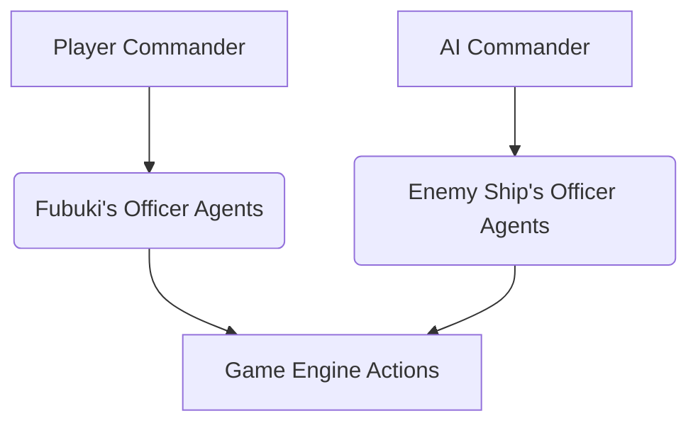
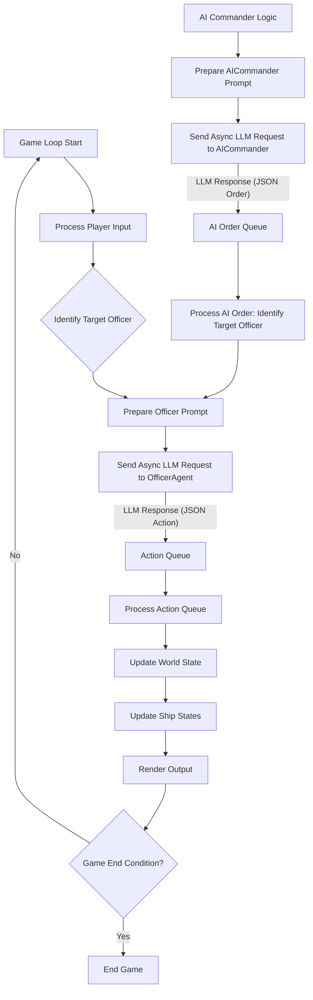

# Real-Time Tactical Ship Simulation Game Architecture

## 1. Overall Structure

The game architecture is designed around a client-server model, though initially, it can be implemented as a single-process application for simplicity. The core components include a `World` managing the game state and physics, `Ship` objects representing the vessels, and various modules within each `Ship` for specific functionalities (Engine, Guns, Torpedo Launchers). An input/output system will handle player interactions and display game information. The `Agent` and `Channel` concepts from `SimCapt.py` will be integrated to facilitate communication and crew control, especially for future LLM integration. Player commands will be passed to LLM agents in the bridge of the ship, and these agents will interpret commands into actions, passing them to different divisions within the ship for execution. Players must rely on their crew. If a crew member is killed in action (KIA), the player will not be able to command modules directly until another crew officer comes to the bridge (or another alive officer on the bridge takes on multiple roles, though they cannot command multiple modules simultaneously). A new officer coming from a lower deck will lack context, as the public channel (heard by all bridge members) may not include all past information. If all officers are dead, lower-rank crew (represented by fresh LLMs with no prior context of naval battles, channels, or modules) will attempt to assist, unless the player announces abandonment of the ship.

```mermaid
graph TD
    A[Game Application] --> B(Input Handler)
    A --> C(Output Renderer)
    B --> D{Game Loop}
    C --> D
    D --> E[World]
    E --> F[Ship 1]
    E --> G[Ship 2]
    F --> H[EngineRoom]
    F --> I[Gun(s)]
    F --> J[TorpedoLauncher(s)]
    F --> K[ShipSpeedResist Physics]
    G --> H
    G --> I
    G --> J
    G --> K
    E --> L[Projectiles]
    E --> M[Environment]
    F --> N[Agents (Crew)]
    G --> O[Agents (Crew)]
    N --> P[Channels (Communication)]
    O --> P
    B -- Player Commands --> N
    B -- Player Commands --> O
```

## 2. `Ship` Class Design

The `Ship` class will serve as a central container for all ship-specific systems and properties. It will encapsulate the existing Python modules and integrate the physics model.

**Class Name:** `Ship`

**Attributes:**
*   `id`: Unique identifier for the ship.
*   `name`: Name of the ship (e.g., "Fubuki").
*   `hp`: Current health points.
*   `location`: Current geographical coordinates (using `geopy.point.Point`).
*   `direction`: Current heading in degrees (0-359).
*   `speed`: Current speed in knots (managed by `EngineRoom` and `ShipSpeedResist`).
*   `engine_room`: An instance of `module.Engine.EngineRoom`.
*   `guns`: A list of `module.Gun.Gun` instances (e.g., `Type3_127mm`).
*   `torpedo_launchers`: A list of `module.TorpedoLauncher.TorpedoLauncher` instances (e.g., `Torpedo_610mm_Launcher`).
*   `physics_model`: An instance of `module.ShipSpeedResist.Ship` (or a similar class for physics calculations).
*   `crew_agents`: A list of `Agent` instances representing the ship's crew, each linked to specific modules or functions.
*   `communication_channels`: A dictionary or list of `Channel` instances for internal ship communication (e.g., bridge to engine room).
*   `bridge_personnel`: A list of `Agent` instances specifically for bridge officers, handling player commands.

**Methods:**
*   `__init__(self, name, initial_location, length, displacement, engine_power)`: Constructor to initialize ship properties and modules.
*   `update(self, delta_time)`: Updates the ship's state, including movement based on engine output and physics, and module states.
*   `take_damage(self, damage_amount, hit_location)`: Applies damage to the ship and potentially its modules.
*   `get_status()`: Returns a comprehensive status report of the ship and its modules.
*   `set_engine_speed(self, speed)`: Delegates to `engine_room.set_speed()`.
*   `set_direction(self, direction)`: Updates the ship's heading.
*   `fire_guns(self, target_location)`: Delegates to appropriate `Gun` instances.
*   `launch_torpedoes(self, target_location)`: Delegates to appropriate `TorpedoLauncher` instances.
*   `move(self, hours)`: Calculates new location based on current speed and direction, using `geopy.distance.distance`. (Adapted from `SimCapt.py`)
*   `hit_on(self, by)`: Handles damage based on weapon type. (Adapted from `SimCapt.py`)
*   `process_crew_actions()`: Iterates through `crew_agents` to allow them to perform actions based on their roles and communication.
*   `process_player_command(self, command)`: Passes player commands to bridge agents for interpretation and action.
*   `handle_casualties(self, casualties_data)`: Updates crew status and reassigns roles if necessary.

## 3. `World` Model Design

The `World` class will be the central orchestrator of the game, managing all entities, the environment, and the game loop.

**Class Name:** `World`

**Attributes:**
*   `ships`: A list of `Ship` objects participating in the battle.
*   `projectiles`: A list of active projectiles (e.g., shells, torpedoes).
*   `environment`: Environmental factors (e.g., weather, time of day, sea state).
*   `game_time`: Current simulation time.
*   `timer`: A mechanism to track and advance game time (similar to `Channel.timer` in `SimCapt.py`).
*   `global_channels`: Global communication channels (e.g., `RADIO_CHANNEL` from `SimCapt.py`).

**Methods:**
*   `__init__(self)`: Initializes the world, creates ships, and sets up the environment.
*   `add_ship(self, ship)`: Adds a ship to the world.
*   `add_projectile(self, projectile)`: Adds a projectile to the world.
*   `update(self, delta_time)`: The core update method for the game loop.
    *   Updates `game_time`.
    *   Updates all `Ship` objects (movement, module states).
    *   Updates all `Projectile` objects (movement, collision detection).
    *   Handles environmental changes.
    *   Processes crew actions and communications.
*   `check_collisions()`: Detects collisions between ships and projectiles.
*   `get_ship_by_id(self, ship_id)`: Retrieves a ship by its ID.
*   `get_all_ships_status()`: Returns status for all ships.
*   `run_game_loop()`: Initiates and manages the main game loop.

## 4. Game Loop

The game loop will be the heart of the simulation, continuously updating the game state and rendering output.

```mermaid
graph TD
    A[Initialize Game] --> B{Game Loop}
    B --> C[Process Player Input]
    C --> D[Pass Commands to Bridge Agents]
    D --> E[Update World State]
    E --> F[Update Ship States]
    F --> G[Update Module States (Engine, Guns, Torpedoes)]
    G --> H[Apply Physics (ShipSpeedResist)]
    H --> I[Update Projectile States]
    I --> J[Check Collisions]
    J --> K[Process Crew Actions & Communications]
    K --> L[Handle Crew Casualties & Role Reassignment]
    L --> M[Render Output]
    M --> N{Check Game End Condition?}
    N -- No --> B
    N -- Yes --> O[End Game]
```

**Description of Game Loop Steps:**

1.  **Initialize Game:** Set up the `World` object, create ships, and load initial game data.
2.  **Process Player Input:** Capture player commands (e.g., move ship, fire weapons, change speed). This could be through a simple text interface or a more complex GUI.
3.  **Pass Commands to Bridge Agents:** Player commands are not directly executed but are passed to the `Agent` instances on the ship's bridge. These agents will interpret the commands and decide on the appropriate actions, potentially communicating with other `Agent`s or directly controlling modules.
4.  **Update World State:**
    *   Advance `game_time`.
    *   Call `World.update(delta_time)` which in turn:
        *   Calls `Ship.update(delta_time)` for each ship.
        *   Updates projectile positions and checks for impacts.
        *   Manages environmental changes.
5.  **Update Ship States:** Each `Ship` object updates its internal state:
    *   `EngineRoom` adjusts speed and direction based on commands from agents.
    *   `Gun` and `TorpedoLauncher` modules handle loading, firing, and fault/damage states, also based on agent commands.
    *   `ShipSpeedResist` calculates the actual speed based on engine power and resistance.
6.  **Update Projectile States:** Projectiles move, and their trajectories are calculated. Collision detection is performed.
7.  **Check Collisions:** Determine if any projectiles have hit ships, and apply damage accordingly.
8.  **Process Crew Actions & Communications:** This is where the `Agent` and `Channel` system comes into play.
    *   `Agent` objects (crew members) can react to events, communicate via `Channel`s, and use their `controll_tools` to interact with ship modules.
    *   This step is crucial for future LLM integration, allowing LLMs to act as crew members.
9.  **Handle Crew Casualties & Role Reassignment:** If crew members take casualties, their roles may need to be reassigned. This could involve other bridge officers taking on multiple roles (with potential penalties) or lower-rank, less-contextualized LLM agents stepping in.
10. **Render Output:** Display the current game state to the player (e.g., ship positions, health, module status, messages).
11. **Check Game End Condition:** Determine if the game has ended (e.g., one ship is destroyed, time limit reached, player announces abandonment). If not, loop back to input processing.

## 5. Data Flow

Data flows primarily through the `World` object, which acts as the central hub, and within the `Ship` objects, which encapsulate their internal systems.

```mermaid
graph TD
    A[Player Input] --> B[Input Handler]
    B --> C[Bridge Agents]
    C -- Interpreted Commands --> D[Ship 1]
    C -- Interpreted Commands --> E[Ship 2]

    D --> F[EngineRoom]
    D --> G[Gun(s)]
    D --> H[TorpedoLauncher(s)]
    D --> I[ShipSpeedResist]
    D --> J[Crew Agents (Divisions)]

    E --> K[EngineRoom]
    E --> L[Gun(s)]
    E --> M[TorpedoLauncher(s)]
    E --> N[ShipSpeedResist]
    E --> O[Crew Agents (Divisions)]

    F -- Speed/Direction --> I
    I -- Calculated Speed --> F
    G -- Firing Command --> P[World]
    H -- Launch Command --> P

    P -- Projectile Data --> Q[Projectiles]
    Q -- Collision Data --> D
    Q -- Collision Data --> E

    J -- Module Control --> F
    J -- Module Control --> G
    J -- Module Control --> H
    J -- Communication --> R[Channels]
    O -- Module Control --> K
    O -- Module Control --> L
    O -- Module Control --> M
    O -- Communication --> R

    R -- Messages --> J
    R -- Messages --> O
    R -- Global Messages --> P
    R -- Bridge Communication --> C

    P -- Game State --> S[Output Renderer]
    S --> T[Display to Player]
    D -- Casualties/Status --> C
    E -- Casualties/Status --> C
```

**Key Data Flow Paths:**

*   **Player Input to Bridge Agents:** Player commands are sent to the `Bridge Agents` on the ship. These agents interpret the high-level commands into specific actions.
*   **Bridge Agents to Crew Agents/Modules:** The `Bridge Agents` communicate with other `Crew Agents` in different divisions (e.g., engine room, gunnery) via `Channels` or may directly issue commands to the ship's modules.
*   **World to Ships:** The `World` updates each `Ship` object, passing `delta_time` for their internal simulations.
*   **Ship Internal Data Flow:**
    *   `EngineRoom` outputs speed and direction, which are used by `ShipSpeedResist` to calculate actual movement.
    *   `Gun` and `TorpedoLauncher` modules receive commands from the `Crew Agents` and report their status back.
    *   `ShipSpeedResist` provides physics calculations back to the `EngineRoom` and the `Ship`.
*   **Ship to World (Projectiles):** When weapons are fired, the `Ship` creates `Projectile` objects managed by the `World`.
*   **World to Ships (Damage/Collisions):** The `World` detects collisions and informs the relevant `Ship` objects to `take_damage()`. This may also trigger casualty checks.
*   **Crew Agents and Channels:**
    *   `Crew Agents` interact with their assigned modules.
    *   `Crew Agents` communicate with each other via `Channel` objects.
*   **World to Output Renderer:** The `World` provides the current game state to the `Output Renderer` for display.

## 6. Multi-Agent Command Structure

The naval simulation game will leverage a multi-agent command structure, where AI-powered agents interpret natural language commands and translate them into game actions. This system enhances player immersion by allowing natural language interaction with the ship's crew and provides a robust framework for AI-controlled entities.

### 6.1. Agent Hierarchy

The command structure is designed with a clear hierarchy, distinguishing between strategic commanders and tactical officers.

*   **CommanderAgent (e.g., `AICommander`)**:
    *   **Role:** The `CommanderAgent` acts as the strategic mind, analyzing the overall battlefield and making high-level tactical decisions. For the player's ship "Fubuki", the player themselves serves as the Commander. For enemy ships, an `AICommander` bot will fulfill this role.
    *   **Responsibilities:**
        *   Analyze the current game state (`{game_state}`).
        *   Formulate strategic plans to achieve objectives (e.g., neutralize enemy threats, ensure ship survival).
        *   Issue high-level natural language orders to `OfficerAgent`s.
    *   **Output Format:** The `AICommander` outputs a JSON object specifying the recipient officer and the natural language order:
        ```json
        {
          "recipient": "[OFFICER_BOT_NAME]",
          "order": "[NATURAL_LANGUAGE_ORDER]"
        }
        ```
    *   **Reference:** [`prompts/ai_commander_prompt.txt`](prompts/ai_commander_prompt.txt:1)

*   **OfficerAgent Roles (e.g., `WeaponsOfficer`, `HelmOfficer`, `EngineeringOfficer`)**:
    *   **Role:** `OfficerAgent`s are tactical specialists responsible for interpreting the Commander's natural language orders and executing them by translating them into specific, actionable game functions.
    *   **Responsibilities:**
        *   Receive and interpret natural language orders from their Commander (`{commander_order}`).
        *   Analyze the current game state (`{game_state}`) in the context of their specialized role.
        *   Translate the interpreted command into a structured JSON action for the game engine.
    *   **Specific Officer Roles:**
        *   **`WeaponsOfficer`**:
            *   **Role:** Manages the ship's offensive arsenal.
            *   **Commands:** `fire_guns(target_id)`, `launch_torpedoes(target_id)`, `report_status()`.
            *   **Output Format:**
                ```json
                {
                  "action": "[COMMAND_NAME]",
                  "parameters": {
                    "target_id": "[TARGET_ID]"
                  }
                }
                ```
            *   **Reference:** [`prompts/weapons_officer_prompt.txt`](prompts/weapons_officer_prompt.txt:1)
        *   **`HelmOfficer`**:
            *   **Role:** Controls the ship's movement and navigation.
            *   **Commands:** `set_direction(degrees)`, `set_speed(knots)`, `report_status()`.
            *   **Output Format:**
                ```json
                {
                  "action": "[COMMAND_NAME]",
                  "parameters": {
                    "[PARAMETER_NAME]": [VALUE]
                  }
                }
                ```
            *   **Reference:** [`prompts/helm_officer_prompt.txt`](prompts/helm_officer_prompt.txt:1)
        *   **`EngineeringOfficer`**:
            *   **Role:** Manages the ship's propulsion and power systems.
            *   **Commands:** `set_engine_speed(knots)`, `report_status()`.
            *   **Output Format:**
                ```json
                {
                  "action": "[COMMAND_NAME]",
                  "parameters": {
                    "speed": [VALUE]
                  }
                }
                ```
            *   **Reference:** [`prompts/engineering_officer_prompt.txt`](prompts/engineering_officer_prompt.txt:1)

*   **Chain of Command:**
    *   **Player (Commander of "Fubuki")**: Issues natural language commands directly to their ship's `OfficerAgent`s (e.g., "Weapons Officer, fire at target Alpha!").
    *   **AI Commander (Enemy Ship)**: Receives high-level objectives (potentially from a higher-level AI or script) and issues natural language orders to its own `OfficerAgent`s.
    *   **Officer Agents**: Receive orders from their respective Commanders and translate them into game engine actions.



### 6.2. Communication and Command Flow

The system is designed to efficiently route player commands and AI decisions through the agent hierarchy to influence the game state.

*   **Player Natural Language Input Routing:**
    1.  The player inputs a natural language command (e.g., "Weapons Officer, engage enemy ship with main guns.").
    2.  The `Input Handler` in the game application identifies the intended `OfficerAgent` (e.g., `WeaponsOfficer`) based on keywords or explicit addressing in the command.
    3.  The command is then passed to the identified `OfficerAgent`'s LLM prompt as the `{commander_order}`.

*   **Game State Serialization and Injection:**
    1.  At each tick of the game loop, the `World` object will gather relevant information about the current game state. This includes:
        *   Ship positions, health, speed, and heading.
        *   Status of ship modules (guns loaded, engine damage, torpedo availability).
        *   Enemy ship status (ID, location, known damage).
        *   Environmental factors (if relevant to agent decision-making).
    2.  This information will be serialized into a concise, structured format (e.g., JSON string or a custom delimited string) suitable for injection into the `{game_state}` placeholder within each agent's prompt. This ensures that the LLMs have the necessary context to make informed decisions.

*   **JSON Output Format Sufficiency:**
    *   Yes, the JSON output format specified in the prompts (`{"recipient": "...", "order": "..."}` for `AICommander` and `{"action": "...", "parameters": {...}}` for `OfficerAgent`s) is explicitly designed to be parsed directly by the game engine. This structured output allows for clear, unambiguous translation of LLM responses into executable game actions, ensuring compatibility and ease of integration.

### 6.3. LLM Integration

The integration with Large Language Models (LLMs) will be managed through a dedicated client, ensuring secure and efficient communication.

*   **LLM Client (`fastapi_poe`)**:
    *   `fastapi_poe` will serve as the primary LLM client, handling the communication between the game engine and the LLM service.
    *   Each `Agent` (e.g., `AICommander`, `WeaponsOfficer`) will correspond to a specific named bot within `fastapi_poe`. This allows for distinct prompts, behaviors, and potentially different underlying LLM models for each agent role.
    *   When an agent needs to process a command or game state, the game engine will construct the appropriate prompt (with `{game_state}` and `{commander_order}` injected) and send it to the corresponding `fastapi_poe` bot.

*   **API Key Management (`.env` file)**:
    *   To ensure security and flexibility, API keys for the LLM service will not be hardcoded in the application.
    *   Instead, they will be stored in a `.env` file (e.g., `API_KEY=your_llm_api_key_here`) in the project root.
    *   The game application will load these environment variables at startup using a library like `python-dotenv`, making the API keys accessible to the `fastapi_poe` client without exposing them in the codebase.

### 6.4. Game Loop Integration

Modifications to the main game loop in `main.py` are necessary to accommodate the asynchronous nature of LLM processing and the multi-agent command flow.

*   **Necessary Modifications to `main.py`:**
    1.  **Player Input Handling:** The `Process Player Input` step will be enhanced to parse natural language commands, identify the target `OfficerAgent`, and prepare the input for LLM processing.
    2.  **Asynchronous Agent Processing:**
        *   LLM calls are inherently asynchronous operations. The game loop must be designed to send requests to LLM agents without blocking the main thread.
        *   Python's `asyncio` library will be crucial for managing these concurrent LLM calls. When a player command or an `AICommander` order is issued, an asynchronous task will be initiated to send the prompt to the relevant LLM bot.
        *   The game loop will continue to update the world state while waiting for LLM responses.
    3.  **World State Updates from Agent Actions:**
        *   A mechanism (e.g., an asynchronous queue or a callback system) will be implemented to receive the structured JSON outputs from the LLM agents once their processing is complete.
        *   These outputs will then be validated and translated into direct calls to `Ship` or module methods (e.g., `ship.fire_guns()`, `ship.set_direction()`).
        *   The `Update World State` and `Update Ship States` steps in the game loop will incorporate logic to process these queued agent actions, ensuring that LLM-driven commands are applied to the game world in a timely manner.
    4.  **`commander_order` Injection for AICommander:** For the enemy `AICommander`, the `{commander_order}` placeholder in its prompt will be populated by a higher-level AI or a predefined script that dictates the enemy's overall strategy. This will be managed within the `main.py` game loop or an overarching AI manager.

